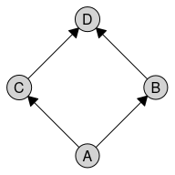

# caugi

> **Causal Graph Interface (for R)** — a fast and flexible toolbox for
> building, coercing and analyzing causal graphs.

## What is `caugi`?

`caugi` (pronounced “corgi”) stands for **Causal Graph Interface**. It
is a *causality-first* graph package that focuses on performance and
flexibility. If you are developing scripts or algorithms in the field of
causality or if you are learning about causal graphs for the first time,
`caugi` is made for you.

## Installation

You can install the development version of `caugi` from GitHub with:

``` r
pak::pak("frederikfabriciusbjerre/caugi")
```

or directly from CRAN with:

``` r
install.packages("caugi")
```

### Installing Rust

Rust is required for `caugi` to work. If you don’t have Rust installed,
visit [rustup.rs](https://rustup.rs/) for installation instructions
appropriate for your platform.

Alternatively, you may install Rust from your OS package manager.

## The basic object: `caugi`

A `caugi` graph object is the bread and butter of the `caugi` package.
It is easy to create, query, and modify.

``` r
library(caugi)
```

You can create simple graphs as well as a number of predefined graph
classes. Currently, we support `"UNKNOWN"`, `"DAG"`, `"PDAG"`, `"ADMG"`,
and `"UG"`. We plan on supporting several other causal graph types in
future releases, such as `"PAG"`, `"MAG"`, and `"SWIG"`.

``` r
# a tiny DAG
cg <- caugi(
  A %-->% B + C,
  B %-->% D,
  C %-->% D,
  class = "DAG"
)

plot(cg)
```



### Edge operators

The available edges in `caugi` are listed below:

- `%-->%` (directed)
- `%---%` (undirected)
- `%<->%` (bidirected)
- `%o->%` (partially directed)
- `%o--%` (partially undirected)
- `%o-o%` (partial)

You can register more types with
[`register_caugi_edge()`](https://caugi.org/dev/reference/register_caugi_edge.md),
if you find that you need a more expressive set of edges. For example,
if you want to represent a directed edge in the reverse direction, you
can do so like this:

``` r
register_caugi_edge(
  glyph = "<--",
  tail_mark = "arrow",
  head_mark = "tail",
  class = "directed",
  symmetric = FALSE
)

caugi(A %-->% B, B %<--% C, class = "DAG")
#> <caugi object; 3 nodes, 2 edges; simple: TRUE; built: TRUE; ptr=0x562aff8da3a0>
#>   graph_class: DAG
#>   nodes: A, B, C
#>   edges: A-->B, B<--C

# reset the registry to default with original edges
reset_caugi_registry()
```

We expect this feature to be needing further polishing in future
releases, and we would love your input if you use this feature!

## Querying and metrics

`caugi` provides a number of functions to query and analyze `caugi`
objects. Some of the available functions are:

- Relational queries, such as
  [`parents()`](https://caugi.org/dev/reference/parents.md),
  [`ancestors()`](https://caugi.org/dev/reference/ancestors.md),
  [`neighbors()`](https://caugi.org/dev/reference/neighbors.md), and
  more.
- Structural queries, such as
  [`is_acyclic()`](https://caugi.org/dev/reference/is_acyclic.md),
  [`is_cpdag()`](https://caugi.org/dev/reference/is_cpdag.md), and more.
- Graph manipulations, such as `add_edge()`, `remove_node()`, and more.
- Graph metrics, such as
  [`shd()`](https://caugi.org/dev/reference/shd.md) and
  [`aid()`](https://caugi.org/dev/reference/aid.md).

## How it works

`caugi` graphs are represented in a compact Compressed Sparse Row (CSR)
format in Rust. `caugi` works with a front-loading philosophy. Since the
`caugi` graph is stored in a CSR format, mutations of the graph is
computationally expensive compared to other graph storage systems, *but*
it allows for very fast querying. Additionally to the storage format of
the graph itself, `caugi` also stores additional information about node
relations in such a way that it allows for faster queries without
blowing up the object too much.

To accommodate for the cost of mutations, `caugi` graphs are built
lazily. This means that when you mutate the graph, for example by adding
edges to it, the graph edits are stored in R, but not in Rust. When you
then need to query the graphs, the graph will rebuild itself in Rust,
and the query will be executed on the newly built graph. You can also
use the `build(cg)` function to force building the graph in Rust at any
time.

## Why?

It’s fast, *dawg* 🐶 See the [vignette on
performance](https://caugi.org/articles/performance.html) for
benchmarks.

## Contribution

Would you like to contribute? Great! Please see [Contributing to
caugi](https://caugi.org/CONTRIBUTING.html) for detailed guidelines on
code style, testing, and the development workflow. Quick tips: follow
the tidyverse style guide for R code, run `styler::style_pkg()` for R
and `cargo fmt` for Rust before PRs, and write tests for new features.

Did you find run into problems? That’s *paw-ful*! Please report an
[issue](https://github.com/frederikfabriciusbjerre/caugi/issues)!
